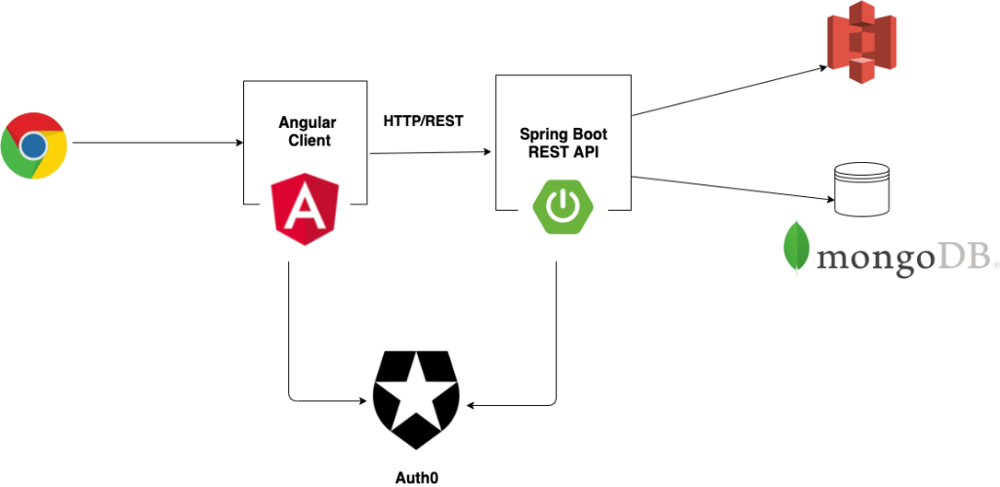

# Youtube Clone
    User can Upload new Videos
    User can Upload Thumbnails for the Videos
    User can View Videos
    User can Like/Dislike a Video
    User can Subscribe to another User, to receive updates about future videos
    User can Login/Logout using Single Sign On
    User can comment on Videos
    User can view the History of Videos he/she watched
    User can view the List of Videos he/she Liked

  

## Technologies Used

So to develop this project, we use the following technologies:

    Spring Boot
    Spring Security
    Spring Data JPA
    MongoDB
    Angular 13
    Angular Material
    TypeScript
    CSS
    HTML
    AWS S3 – to store Videos and Thumbnails
